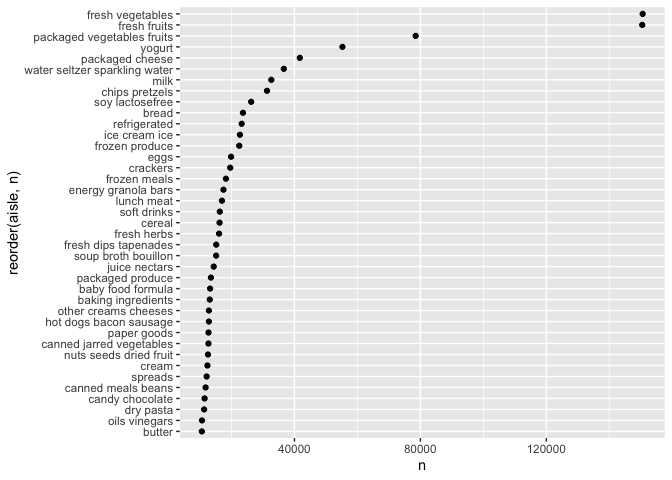

p8105\_hw3\_sl4836
================
Hun
10/16/2021

``` r
getwd()
```

    ## [1] "/Users/iseonghun/p8105_hw3_sl4836"

``` r
dir.create(file.path(getwd(), "hw3_data_file"), recursive = TRUE)
```

    ## Warning in dir.create(file.path(getwd(), "hw3_data_file"), recursive = TRUE): '/
    ## Users/iseonghun/p8105_hw3_sl4836/hw3_data_file' already exists

``` r
list.files()
```

    ## [1] "hw3_data_file"          "p8105_hw3_sl4836_files" "p8105_hw3_sl4836.md"   
    ## [4] "p8105_hw3_sl4836.Rmd"   "p8105_hw3_sl4836.Rproj"

``` r
library(p8105.datasets)
data("instacart")
```

``` r
instacart <- instacart

instacart %>% dim()
```

    ## [1] 1384617      15

``` r
instacart %>% names() 
```

    ##  [1] "order_id"               "product_id"             "add_to_cart_order"     
    ##  [4] "reordered"              "user_id"                "eval_set"              
    ##  [7] "order_number"           "order_dow"              "order_hour_of_day"     
    ## [10] "days_since_prior_order" "product_name"           "aisle_id"              
    ## [13] "department_id"          "aisle"                  "department"

``` r
instacart %>% head()
```

    ## # A tibble: 6 × 15
    ##   order_id product_id add_to_cart_order reordered user_id eval_set order_number
    ##      <int>      <int>             <int>     <int>   <int> <chr>           <int>
    ## 1        1      49302                 1         1  112108 train               4
    ## 2        1      11109                 2         1  112108 train               4
    ## 3        1      10246                 3         0  112108 train               4
    ## 4        1      49683                 4         0  112108 train               4
    ## 5        1      43633                 5         1  112108 train               4
    ## 6        1      13176                 6         0  112108 train               4
    ## # … with 8 more variables: order_dow <int>, order_hour_of_day <int>,
    ## #   days_since_prior_order <int>, product_name <chr>, aisle_id <int>,
    ## #   department_id <int>, aisle <chr>, department <chr>

``` r
Arranged_aisles <- instacart %>% 
  group_by(aisle) %>% 
  summarise(n = n()) %>% arrange(desc(n))

Arranged_aisles %>% 
  filter(n>10000) %>%
  ggplot(aes(x = reorder(aisle, n), y =n)) + 
  geom_point() + 
  coord_flip()
```

<!-- --> 1.
There are 134 aisles. Fresh vegetables aisles are the most items ordered
from.

2.  

``` r
options(knitr.kable.NA = 0)

baking_top3 <- instacart %>% 
  filter(aisle == "baking ingredients") %>% 
  group_by(product_name) %>% 
  summarise(n = n()) %>% 
  arrange(desc(n)) %>% 
  slice(1:3) %>%
  mutate(aisle = "baking ingredients")

dog_food_top3 <- instacart %>% 
  filter(aisle == "dog food care") %>% 
  group_by(product_name) %>% 
  summarise(n = n()) %>% 
  arrange(desc(n)) %>% 
  slice(1:3) %>%
  mutate(aisle = "dog food care")

packaged_vege_fruit_top3 <- instacart %>% 
  filter(aisle == "packaged vegetables fruits") %>% 
  group_by(product_name) %>% 
  summarise(n = n()) %>% 
  arrange(desc(n)) %>% 
  slice(1:3) %>%
  mutate(aisle = "packaged vegetables fruits")

bind_rows(baking_top3 ,dog_food_top3, packaged_vege_fruit_top3) %>%
  pivot_wider(names_from = product_name, values_from = n)  %>%
  knitr::kable(align = "c", format = "pipe")
```

|           aisle            | Light Brown Sugar | Pure Baking Soda | Cane Sugar | Snack Sticks Chicken & Rice Recipe Dog Treats | Organix Chicken & Brown Rice Recipe | Small Dog Biscuits | Organic Baby Spinach | Organic Raspberries | Organic Blueberries |
|:--------------------------:|:-----------------:|:----------------:|:----------:|:---------------------------------------------:|:-----------------------------------:|:------------------:|:--------------------:|:-------------------:|:-------------------:|
|     baking ingredients     |        499        |       387        |    336     |                       0                       |                  0                  |         0          |          0           |          0          |          0          |
|       dog food care        |         0         |        0         |     0      |                      30                       |                 28                  |         26         |          0           |          0          |          0          |
| packaged vegetables fruits |         0         |        0         |     0      |                       0                       |                  0                  |         0          |         9784         |        5546         |        4966         |

``` r
instacart %>% 
  filter(product_name == "Pink Lady Apples" |product_name == "Coffee Ice Cream") %>%
  group_by(product_name, order_dow) %>% 
  summarise(mean_hour = mean(order_hour_of_day)) %>%
  pivot_wider(names_from = order_dow, values_from = mean_hour) %>%
  knitr::kable(align = "c", format = "pipe")
```

    ## `summarise()` has grouped output by 'product_name'. You can override using the `.groups` argument.

|  product\_name   |    0     |    1     |    2     |    3     |    4     |    5     |    6     |
|:----------------:|:--------:|:--------:|:--------:|:--------:|:--------:|:--------:|:--------:|
| Coffee Ice Cream | 13.77419 | 14.31579 | 15.38095 | 15.31818 | 15.21739 | 12.26316 | 13.83333 |
| Pink Lady Apples | 13.44118 | 11.36000 | 11.70213 | 14.25000 | 11.55172 | 12.78431 | 11.93750 |
