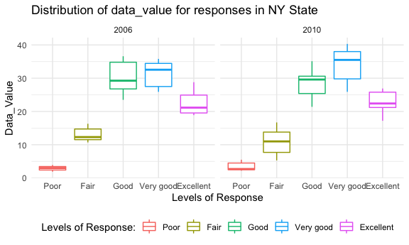
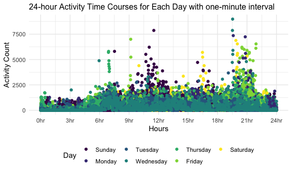

p8105\_hw3\_sl4836
================
Hun
10/16/2021

\#ggplot theme template from Dr.Goldsmith github

``` r
knitr::opts_chunk$set(
  fig.width = 6,
  fig.asp = .6,
  out.width = "90%"
)

theme_set(theme_minimal() + theme(legend.position = "bottom"))

options(
  ggplot2.continuous.colour = "viridis",
  ggplot2.continuous.fill = "viridis"
)

scale_colour_discrete = scale_colour_viridis_d
scale_fill_discrete = scale_fill_viridis_d
```

\#Problem 0

``` r
getwd()
```

    ## [1] "/Users/iseonghun/p8105_hw3_sl4836"

``` r
dir.create(file.path(getwd(), "hw3_data_file"), recursive = TRUE)

list.files()
```

    ## [1] "hw3_data_file"          "p8105_hw3_sl4836_files" "p8105_hw3_sl4836.md"   
    ## [4] "p8105_hw3_sl4836.Rmd"   "p8105_hw3_sl4836.Rproj"

\#Problem 1\_Data\_Summary

``` r
library(p8105.datasets)
data("instacart")
```

``` r
instacart <- instacart 

instacart %>% head
```

    ## # A tibble: 6 × 15
    ##   order_id product_id add_to_cart_order reordered user_id eval_set order_number
    ##      <int>      <int>             <int>     <int>   <int> <chr>           <int>
    ## 1        1      49302                 1         1  112108 train               4
    ## 2        1      11109                 2         1  112108 train               4
    ## 3        1      10246                 3         0  112108 train               4
    ## 4        1      49683                 4         0  112108 train               4
    ## 5        1      43633                 5         1  112108 train               4
    ## 6        1      13176                 6         0  112108 train               4
    ## # … with 8 more variables: order_dow <int>, order_hour_of_day <int>,
    ## #   days_since_prior_order <int>, product_name <chr>, aisle_id <int>,
    ## #   department_id <int>, aisle <chr>, department <chr>

``` r
instacart_names <- names(instacart)
instacart_nrow <- nrow(instacart)
instacart_ncol <- ncol(instacart)
```

The size of the dataset is **1384617 x** **15** and **15** variables:
*order\_id, product\_id, add\_to\_cart\_order, reordered, user\_id,
eval\_set, order\_number, order\_dow, order\_hour\_of\_day,
days\_since\_prior\_order, product\_name, aisle\_id, department\_id,
aisle, department.* There are **1384617** number of observations without
missing data. Among these, there are 4 character variables and 11
numeric variables.

\#Problem 1\_(a)

``` r
Arranged_aisles <- 
  instacart %>% 
  group_by(aisle) %>% 
  summarise(n = n()) %>% 
  arrange(desc(n))

number_aisles <- 
  nrow(Arranged_aisles)

top_item <- 
  Arranged_aisles %>% 
  pull(aisle) %>%
  first()
```

There are **134** aisles. **fresh vegetables** are the most items
ordered from aisles.

\#Problem 1\_(b)\_Making a plot that shows the number of items ordered
in each aisle

``` r
Arranged_aisles %>% 
  filter(n>10000) %>%
  ggplot(aes(x = reorder(aisle, n), y = n)) + 
  geom_bar(stat = "identity") + 
  coord_flip() +
  labs(y = "Number of Items", x = "Items") +
  ggtitle("The Number of Items Ordered in Each Aisle") +
  theme(plot.title = element_text(hjust = 0.3))
```


\#Problem 1\_(c)\_making a table showing the three most popular items in
each aisles

``` r
options(knitr.kable.NA = 0)

baking_top3 <- instacart %>% 
  filter(aisle == "baking ingredients") %>% 
  group_by(product_name) %>% 
  summarise(n = n()) %>% 
  arrange(desc(n)) %>% 
  slice(1:3) %>%
  mutate(aisle = "baking ingredients")

dog_food_top3 <- instacart %>% 
  filter(aisle == "dog food care") %>% 
  group_by(product_name) %>% 
  summarise(n = n()) %>% 
  arrange(desc(n)) %>% 
  slice(1:3) %>%
  mutate(aisle = "dog food care")

packaged_vege_fruit_top3 <- instacart %>% 
  filter(aisle == "packaged vegetables fruits") %>% 
  group_by(product_name) %>% 
  summarise(n = n()) %>% 
  arrange(desc(n)) %>% 
  slice(1:3) %>%
  mutate(aisle = "packaged vegetables fruits")

bind_rows(baking_top3 ,
          dog_food_top3, 
          packaged_vege_fruit_top3) %>% 
  mutate(aisle = str_to_title(aisle)) %>%
  rename(Aisle = aisle) %>%
  pivot_wider(names_from = product_name, 
              values_from = n)  %>%
  knitr::kable(align = "c", format = "pipe", 
               caption = "**Table 1: Three Most Popular Items 
               with their counts in Each Aisles**")
```

|           Aisle            | Light Brown Sugar | Pure Baking Soda | Cane Sugar | Snack Sticks Chicken & Rice Recipe Dog Treats | Organix Chicken & Brown Rice Recipe | Small Dog Biscuits | Organic Baby Spinach | Organic Raspberries | Organic Blueberries |
|:--------------------------:|:-----------------:|:----------------:|:----------:|:---------------------------------------------:|:-----------------------------------:|:------------------:|:--------------------:|:-------------------:|:-------------------:|
|     Baking Ingredients     |        499        |       387        |    336     |                       0                       |                  0                  |         0          |          0           |          0          |          0          |
|       Dog Food Care        |         0         |        0         |     0      |                      30                       |                 28                  |         26         |          0           |          0          |          0          |
| Packaged Vegetables Fruits |         0         |        0         |     0      |                       0                       |                  0                  |         0          |         9784         |        5546         |        4966         |

**Table 1: Three Most Popular Items with their counts in Each Aisles**

\#Problem 1\_(d)\_Making a table showing the mean hour of the day

``` r
instacart %>% 
  filter(product_name == "Pink Lady Apples" |product_name == "Coffee Ice Cream") %>%
  group_by(product_name, order_dow) %>% 
  summarise(mean_hour = mean(order_hour_of_day)) %>%
  rename(Product_Name = product_name) %>%
  pivot_wider(names_from = order_dow, values_from = mean_hour) %>%
  knitr::kable(align = "c", format = "pipe",
               caption = "**The Mean Hour of the Day at which
               Each Item is Ordered on Each Day**"
               )
```

|  Product\_Name   |    0     |    1     |    2     |    3     |    4     |    5     |    6     |
|:----------------:|:--------:|:--------:|:--------:|:--------:|:--------:|:--------:|:--------:|
| Coffee Ice Cream | 13.77419 | 14.31579 | 15.38095 | 15.31818 | 15.21739 | 12.26316 | 13.83333 |
| Pink Lady Apples | 13.44118 | 11.36000 | 11.70213 | 14.25000 | 11.55172 | 12.78431 | 11.93750 |

**The Mean Hour of the Day at which Each Item is Ordered on Each Day**

\#Problem 2\_Data Import

``` r
devtools::install_github("p8105/p8105.datasets")
library(p8105.datasets)

data("brfss_smart2010") 
```

\#Problem 2\_(a)\_Data\_Cleaning

``` r
brfss <- brfss_smart2010 


brfss_clean <- brfss %>% 
  janitor::clean_names() %>% 
  filter(topic == "Overall Health") %>%
  filter(response %in% c("Excellent", "Very good",
                         "Good","Fair", "Poor" )) %>%
  mutate(response = as.factor(response) %>% 
           fct_relevel("Poor", "Fair", "Good", "Very good",
                       "Excellent")) 
```

\#Problem 2\_(b)\_Showing States observed at 7 or more observations

``` r
brfss_clean %>% 
  filter(year == 2002) %>% 
  group_by(locationabbr) %>% 
  summarise(n = n_distinct(locationdesc)) %>% 
  filter(n >= 7) %>%
  arrange(n)
```

    ## # A tibble: 6 × 2
    ##   locationabbr     n
    ##   <chr>        <int>
    ## 1 CT               7
    ## 2 FL               7
    ## 3 NC               7
    ## 4 MA               8
    ## 5 NJ               8
    ## 6 PA              10

``` r
brfss_clean %>% 
  filter(year == 2010) %>% 
  group_by(locationabbr) %>% 
  summarise(n = n_distinct(locationdesc)) %>% 
  filter(n >= 7) %>%
  arrange(n)
```

    ## # A tibble: 14 × 2
    ##    locationabbr     n
    ##    <chr>        <int>
    ##  1 CO               7
    ##  2 PA               7
    ##  3 SC               7
    ##  4 OH               8
    ##  5 MA               9
    ##  6 NY               9
    ##  7 NE              10
    ##  8 WA              10
    ##  9 CA              12
    ## 10 MD              12
    ## 11 NC              12
    ## 12 TX              16
    ## 13 NJ              19
    ## 14 FL              41

``` r
brfss_clean %>% 
  filter(response == "Excellent") %>%
  rename(States = locationabbr) %>%
  group_by(year, States) %>%
  summarise(mean_data_value = mean(data_value, na.rm=T)) %>% 
  ggplot(aes(year, mean_data_value, color=States)) + 
  geom_point(size=0.2) + 
  geom_line(aes(group=States, alpha = 0.5)) +
  theme(legend.position = "right", legend.title =
          element_text(colour="black", size=10, face="bold"), 
        legend.key.size = unit(0.5, 'cm')) 
```


``` r
library(ggridges)

brfss_clean %>% 
  filter(year == 2006 | year == 2010, locationabbr == "NY") %>%
  group_by(locationdesc) %>%
  ggplot(aes(response, data_value, color = response)) +
  geom_boxplot() +
  facet_wrap(.~year) + 
  ggtitle("Distribution of data_value for responses in NY State") +
  labs(x = "Levels of Response", y = "Data_Value") +
  scale_color_discrete(name="Levels of Response:")
```


\#Problem 3\_Loading, Tidying, and Wrangling Data

``` r
accel <- read.csv("./hw3_data_file/accel_data.csv") 

clean_accel <- accel %>% 
  janitor::clean_names() %>% 
  pivot_longer(activity_1:activity_1440, 
               names_to = "minutes_in_a_day", values_to = "activity_count", names_prefix =  "activity_") %>%
  mutate(day = day %>% 
           fct_relevel("Sunday", "Monday", "Tuesday", "Wednesday","Thursday","Friday", "Saturday")) %>% 
  mutate(weekday_vs_weekend = ifelse(day %in% c("Monday", "Tuesday", "Wednesday", "Thursday","Friday"), "weekday","weekend")) %>% 
  mutate_if(is.double, as.integer) %>%
  mutate(minutes_in_a_day = as.integer(minutes_in_a_day))
```

\#Problem 3\_Describing the resulting dataset using in-line

``` r
accel_row <- accel %>% nrow()
accel_col <- accel %>% ncol()
accel_names <- accel %>% names()


clean_accel_row <- clean_accel %>% nrow()
clean_accel_col <- clean_accel %>% ncol()
clean_accel_names <- clean_accel %>% names()
```

Originally, the dimension of the pols\_month\_data was **35 x** **1443**
and there are **1443** variables. This represents one person’s activity
data for **35 x** days. After tidying and wrangling the data, the
dimension is **50400 x** **6** and **6** variables: *week, day\_id, day,
minutes\_in\_a\_day, activity\_count, weekday\_vs\_weekend.* There are
**50400** number of observations,this is the total of 1440 minutes of
each day’s combined data (**1440x35 =** **50400**).

\#Problem 3\_(b)\_Creating a table that shows aggregation of a total
activity for each day

``` r
clean_accel %>% 
  group_by(day) %>% 
  summarize(total = sum(activity_count)) %>% 
  rename(Day = day, Total = total) %>%
  knitr::kable(align = "c", format = "pipe", caption = "**Table 1:
               Aggregation of a Total Activity across Minutes for Each Day**")
```

|    Day    |  Total  |
|:---------:|:-------:|
|  Sunday   | 1919213 |
|  Monday   | 1858545 |
|  Tuesday  | 1798521 |
| Wednesday | 2129059 |
| Thursday  | 2090445 |
|  Friday   | 2291448 |
| Saturday  | 1369237 |

**Table 1: Aggregation of a Total Activity across Minutes for Each Day**

According to the Table 1, it’s hard to say there are apparent trends
across days. However, one interesting observation is that the total
activity aggregation on Saturday is far lower than any other days as one
can expect people normally would like to rest on Saturday. It is also to
be observed the total activity on Friday has the highest aggregation.

\#Part 3

``` r
clean_accel %>%
  group_by(day, minutes_in_a_day) %>%
  rename(Day = day) %>%
  ggplot(aes(minutes_in_a_day, activity_count, color = Day)) +
  geom_point() +
  scale_x_continuous(
    breaks = c(0, 180, 360, 540, 720, 900, 1080, 1260, 1440),
    labels = c("0hr", "3hr", "6hr", "9hr", "12hr", "15hr", "18hr", "21hr", "24hr")) + 
  labs(x = "Hours", y="Activity Count") +
  ggtitle("24-hour Activity Time Courses for Each Day with one-minute interval") + 
  theme(plot.title = element_text(size=12))
```


Between 0hr (12am) to 6hr (6am), it is to be observed that the activity
count of a 63 year-old male is the lowest across days as one can expect
people normally sleep during those times. Around 7hr (7am), his activity
count is relatively high on some Thursdays. Around 9hr (9am), his
activity count is quite high on some Fridays. Around 12hr (12pm), his
activity count is high on many Sundays. Between 16hr (4pm) and 17hr
(5pm), his activity count is relatively high on a decent number of
weekends. Between 20hr (8pm) and 22hr(10pm), his activity count is high
across many days, especially on Friday followed by Saturday, Wednesday,
Monday.
