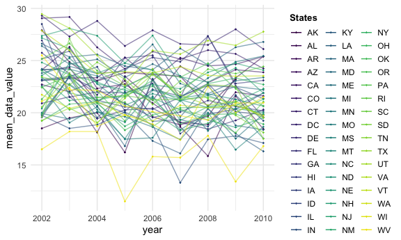

p8105\_hw3\_sl4836
================
Hun
10/16/2021

``` r
knitr::opts_chunk$set(
  fig.width = 6,
  fig.asp = .6,
  out.width = "90%"
)

theme_set(theme_minimal() + theme(legend.position = "bottom"))

options(
  ggplot2.continuous.colour = "viridis",
  ggplot2.continuous.fill = "viridis"
)

scale_colour_discrete = scale_colour_viridis_d
scale_fill_discrete = scale_fill_viridis_d
```

\#Problem 0

``` r
getwd()
```

    ## [1] "/Users/iseonghun/p8105_hw3_sl4836"

``` r
dir.create(file.path(getwd(), "hw3_data_file"), recursive = TRUE)
```

    ## Warning in dir.create(file.path(getwd(), "hw3_data_file"), recursive = TRUE): '/
    ## Users/iseonghun/p8105_hw3_sl4836/hw3_data_file' already exists

``` r
list.files()
```

    ## [1] "hw3_data_file"          "p8105_hw3_sl4836_files" "p8105_hw3_sl4836.md"   
    ## [4] "p8105_hw3_sl4836.Rmd"   "p8105_hw3_sl4836.Rproj"

\#Problem 1

``` r
library(p8105.datasets)
data("instacart")
```

``` r
instacart <- instacart

instacart %>% dim()
```

    ## [1] 1384617      15

``` r
instacart %>% names() 
```

    ##  [1] "order_id"               "product_id"             "add_to_cart_order"     
    ##  [4] "reordered"              "user_id"                "eval_set"              
    ##  [7] "order_number"           "order_dow"              "order_hour_of_day"     
    ## [10] "days_since_prior_order" "product_name"           "aisle_id"              
    ## [13] "department_id"          "aisle"                  "department"

``` r
instacart %>% head()
```

    ## # A tibble: 6 × 15
    ##   order_id product_id add_to_cart_order reordered user_id eval_set order_number
    ##      <int>      <int>             <int>     <int>   <int> <chr>           <int>
    ## 1        1      49302                 1         1  112108 train               4
    ## 2        1      11109                 2         1  112108 train               4
    ## 3        1      10246                 3         0  112108 train               4
    ## 4        1      49683                 4         0  112108 train               4
    ## 5        1      43633                 5         1  112108 train               4
    ## 6        1      13176                 6         0  112108 train               4
    ## # … with 8 more variables: order_dow <int>, order_hour_of_day <int>,
    ## #   days_since_prior_order <int>, product_name <chr>, aisle_id <int>,
    ## #   department_id <int>, aisle <chr>, department <chr>

``` r
Arranged_aisles <- instacart %>% 
  group_by(aisle) %>% 
  summarise(n = n()) %>% 
  arrange(desc(n))

Arranged_aisles
```

    ## # A tibble: 134 × 2
    ##    aisle                              n
    ##    <chr>                          <int>
    ##  1 fresh vegetables              150609
    ##  2 fresh fruits                  150473
    ##  3 packaged vegetables fruits     78493
    ##  4 yogurt                         55240
    ##  5 packaged cheese                41699
    ##  6 water seltzer sparkling water  36617
    ##  7 milk                           32644
    ##  8 chips pretzels                 31269
    ##  9 soy lactosefree                26240
    ## 10 bread                          23635
    ## # … with 124 more rows

There are 134 aisles. Fresh vegetables aisles are the most items ordered
from.

``` r
Arranged_aisles %>% 
  filter(n>10000) %>%
  ggplot(aes(x = reorder(aisle, n), y = n)) + 
  geom_bar(stat = "identity") + 
  coord_flip()
```


``` r
options(knitr.kable.NA = 0)

baking_top3 <- instacart %>% 
  filter(aisle == "baking ingredients") %>% 
  group_by(product_name) %>% 
  summarise(n = n()) %>% 
  arrange(desc(n)) %>% 
  slice(1:3) %>%
  mutate(aisle = "baking ingredients")

dog_food_top3 <- instacart %>% 
  filter(aisle == "dog food care") %>% 
  group_by(product_name) %>% 
  summarise(n = n()) %>% 
  arrange(desc(n)) %>% 
  slice(1:3) %>%
  mutate(aisle = "dog food care")

packaged_vege_fruit_top3 <- instacart %>% 
  filter(aisle == "packaged vegetables fruits") %>% 
  group_by(product_name) %>% 
  summarise(n = n()) %>% 
  arrange(desc(n)) %>% 
  slice(1:3) %>%
  mutate(aisle = "packaged vegetables fruits")

bind_rows(baking_top3 ,dog_food_top3, packaged_vege_fruit_top3) %>%
  pivot_wider(names_from = product_name, values_from = n)  %>%
  knitr::kable(align = "c", format = "pipe")
```

|           aisle            | Light Brown Sugar | Pure Baking Soda | Cane Sugar | Snack Sticks Chicken & Rice Recipe Dog Treats | Organix Chicken & Brown Rice Recipe | Small Dog Biscuits | Organic Baby Spinach | Organic Raspberries | Organic Blueberries |
|:--------------------------:|:-----------------:|:----------------:|:----------:|:---------------------------------------------:|:-----------------------------------:|:------------------:|:--------------------:|:-------------------:|:-------------------:|
|     baking ingredients     |        499        |       387        |    336     |                       0                       |                  0                  |         0          |          0           |          0          |          0          |
|       dog food care        |         0         |        0         |     0      |                      30                       |                 28                  |         26         |          0           |          0          |          0          |
| packaged vegetables fruits |         0         |        0         |     0      |                       0                       |                  0                  |         0          |         9784         |        5546         |        4966         |

``` r
instacart %>% 
  filter(product_name == "Pink Lady Apples" |product_name == "Coffee Ice Cream") %>%
  group_by(product_name, order_dow) %>% 
  summarise(mean_hour = mean(order_hour_of_day)) %>%
  pivot_wider(names_from = order_dow, values_from = mean_hour) %>%
  knitr::kable(align = "c", format = "pipe")
```

    ## `summarise()` has grouped output by 'product_name'. You can override using the `.groups` argument.

|  product\_name   |    0     |    1     |    2     |    3     |    4     |    5     |    6     |
|:----------------:|:--------:|:--------:|:--------:|:--------:|:--------:|:--------:|:--------:|
| Coffee Ice Cream | 13.77419 | 14.31579 | 15.38095 | 15.31818 | 15.21739 | 12.26316 | 13.83333 |
| Pink Lady Apples | 13.44118 | 11.36000 | 11.70213 | 14.25000 | 11.55172 | 12.78431 | 11.93750 |

\#Problem 2

``` r
devtools::install_github("p8105/p8105.datasets")
```

    ## Skipping install of 'p8105.datasets' from a github remote, the SHA1 (412759e3) has not changed since last install.
    ##   Use `force = TRUE` to force installation

``` r
library(p8105.datasets)

data("brfss_smart2010") 
```

``` r
brfss <- brfss_smart2010 


brfss_clean <- brfss %>% 
  janitor::clean_names() %>% 
  filter(topic == "Overall Health") %>%
  filter(response == "Excellent" | response == "Very good" | 
           response == "Good" | response == "Fair" | response == "Poor") %>%
  mutate(response = as.factor(response) %>% fct_relevel("Poor", "Fair", "Good", "Very good", "Excellent")) 
```

``` r
brfss_clean %>% 
  filter(year == 2002) %>% 
  group_by(locationabbr) %>% 
  summarise(n = n()) %>% 
  filter(n>6)
```

    ## # A tibble: 36 × 2
    ##    locationabbr     n
    ##    <chr>        <int>
    ##  1 AZ              10
    ##  2 CO              20
    ##  3 CT              35
    ##  4 DE              15
    ##  5 FL              35
    ##  6 GA              15
    ##  7 HI              20
    ##  8 ID              10
    ##  9 IL              15
    ## 10 IN              10
    ## # … with 26 more rows

``` r
brfss_clean %>% 
  filter(year == 2010) %>% 
  group_by(locationabbr) %>% 
  summarise(n = n()) %>% 
  filter(n>6)
```

    ## # A tibble: 45 × 2
    ##    locationabbr     n
    ##    <chr>        <int>
    ##  1 AL              15
    ##  2 AR              15
    ##  3 AZ              15
    ##  4 CA              60
    ##  5 CO              35
    ##  6 CT              25
    ##  7 DE              15
    ##  8 FL             205
    ##  9 GA              20
    ## 10 HI              20
    ## # … with 35 more rows

``` r
brfss_clean %>% 
  filter(response == "Excellent") %>% 
  group_by(year, locationabbr) %>%
  summarise(mean_data_value = mean(data_value, na.rm=T)) %>%
  ggplot(aes(year, mean_data_value, color=locationabbr)) + 
  geom_point(size=0.2) + 
  geom_line(aes(group=locationabbr, alpha = 0.2)) +
  viridis::scale_color_viridis(name = "Location", discrete =TRUE) +
  theme(legend.position = "right")
```

    ## `summarise()` has grouped output by 'year'. You can override using the `.groups` argument.


``` r
library(ggridges)

brfss_clean %>% filter(year == 2006 | year == 2010 ) %>% filter(locationabbr == "NY") %>% 
  ggplot(aes(data_value,response)) +
  geom_density_ridges(scale=.85) +
  facet_wrap(.~year)
```

    ## Picking joint bandwidth of 2.1

    ## Picking joint bandwidth of 2.03


\#Problem 3

``` r
accel <- read.csv("~/Downloads/accel_data.csv") 

clean_accel <- accel %>% 
  janitor::clean_names() %>% 
  pivot_longer(activity_1:activity_1440, 
               names_to = "minutes_in_a_day", values_to = "activity_count", names_prefix =  "activity_") %>%
  mutate(day = day %>% 
           fct_relevel("Sunday", "Monday", "Tuesday", "Wednesday", 
                       "Thursday","Friday", "Saturday")) %>% 
  mutate(weekday_vs_weekend = ifelse(day %in% c("Monday", "Tuesday", "Wednesday", 
                       "Thursday","Friday"), "weekday","weekend")) %>% 
  mutate_if(is.double, as.integer) %>%
  mutate(minutes_in_a_day = as.integer(minutes_in_a_day))
```

``` r
accel_row <- accel %>% nrow()
accel_col <- accel %>% ncol()
accel_names <- accel %>% names()


clean_accel_row <- clean_accel %>% nrow()
clean_accel_col <- clean_accel %>% ncol()
clean_accel_names <- clean_accel %>% names()
```

Originally, the dimension of the pols\_month\_data was **35 x** **1443**
and there are **1443** variables. This represents one person’s activity
data for **35 x** days. After tidying and wrangling the data, the
dimension is **50400 x** **6** and **6** variables: *week, day\_id, day,
minutes\_in\_a\_day, activity\_count, weekday\_vs\_weekend.* There are
**50400** number of observations,this is the total of 1440 minutes of
each day’s combined data (**1440x35 =** **50400**).

\#part 2

``` r
clean_accel %>% 
  group_by(day) %>% 
  summarize(total = sum(activity_count)) %>% 
  knitr::kable(align = "c", format = "pipe")
```

|    day    |  total  |
|:---------:|:-------:|
|  Sunday   | 1919213 |
|  Monday   | 1858545 |
|  Tuesday  | 1798521 |
| Wednesday | 2129059 |
| Thursday  | 2090445 |
|  Friday   | 2291448 |
| Saturday  | 1369237 |

\#Part 3

``` r
clean_accel %>%
  group_by(day, minutes_in_a_day) %>%
  ggplot(aes(minutes_in_a_day, activity_count, color = day)) +
  geom_point() +
  scale_x_continuous(
    breaks = c(0, 180, 360, 540, 720, 900, 1080, 1260, 1440),
    labels = c("0hr", "3hr", "6hr", "9hr", "12hr", "15hr", "18hr", "21hr", "24hr")
  )
```


